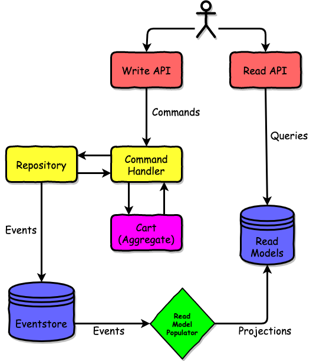

# shopping-cart-event-sourced

[](https://codecov.io/gh/cbeardsmore/shopping-cart-event-sourced)


A shopping cart system in Java 11 and PostgreSQL implementing [Event Sourcing (ES)](https://martinfowler.com/eaaDev/EventSourcing.html) and [Command Query Responsibility Segregation (CQRS)](https://docs.microsoft.com/en-us/azure/architecture/patterns/cqrs).
The system follows a [Hex Arch pattern](https://en.wikipedia.org/wiki/Hexagonal_architecture_(software)) to create loosely coupled components, isolate the core domain logic and facilitate test automation.

<p align="center">
  
</p>

## Build and Run

### Gradle

- To build via gradle:

    `gradle clean build`

### Docker

- To build:

    `docker-compose build`

- To run:

    `docker-compose up --build`


- To test via Postman while running:

	```sh
	npm install -g newman
	./postman/test.sh
	```

## API

### Command Endpoints

- Create a new Cart:

```
POST /cart/create
RESPONSE:
{
  "aggregateId": "UUID"
}
```

- Add a Product:

```
POST /cart/{cartId}
REQUEST: 
{
  "productId": "UUID",
  "name": "Samsung TV",
  "price": 49.99
}
```

- Remove a Product:

```
DELETE /cart/{cartId}/product/{productId}
```

- Checkout:

```
POST /cart/{cartId}/checkout
RESPONSE:
{
  "totalPrice": 199.97
}
```

### Query Endpoints

- Get total price of all checked out carts:

```
GET /carts/total
RESPONSE:
{
  "totalPrice": 199.97
}
```

- Get total price of a specific cart:

```
GET /cart/{cartId}
RESPONSE:
{
  "totalPrice": 199.97
}
```

- Get top 5 most popular products:

```
GET /product/popular
RESPONSE:
{
  "popularProducts": [
    {
      "productId": "UUID"
      "quantity": 430
    }
  ]
}
```
